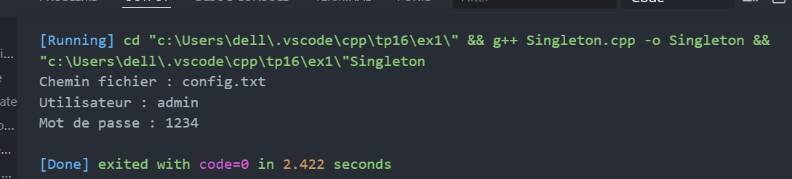
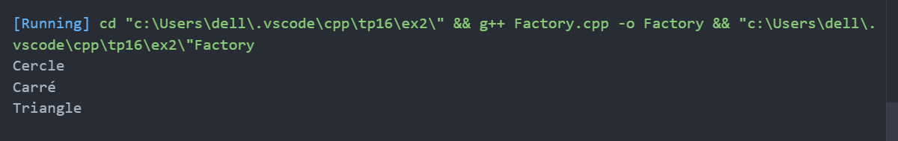
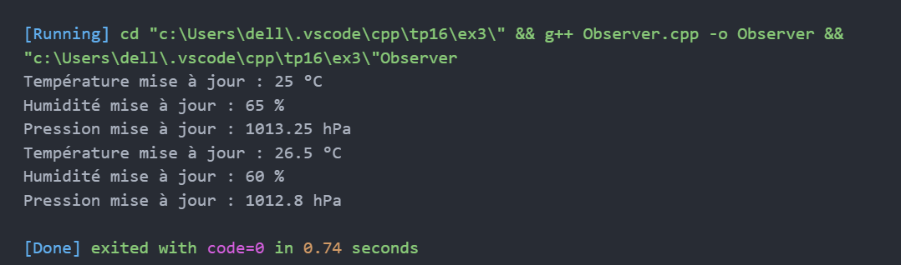
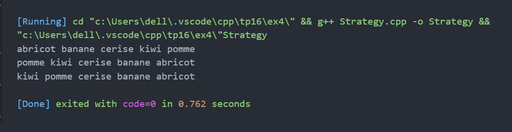

# TP16 : Patrons de conception

## Exercice 1 — Singleton  
Gestion d’une configuration globale avec une instance unique (Singleton).

---

## Exercice 2 — Fabrique (Factory Method)  
Création dynamique de formes géométriques (Cercle, Carré, Triangle) via une fabrique.

---

## Exercice 3 — Observateur (Observer)  
Mise à jour automatique des affichages météo (température, humidité, pression) par la station météo.

---

## Exercice 4 — Stratégie (Strategy)  
Gestion dynamique de stratégies de tri (croissant, décroissant, par longueur) sur un vecteur de chaînes.

